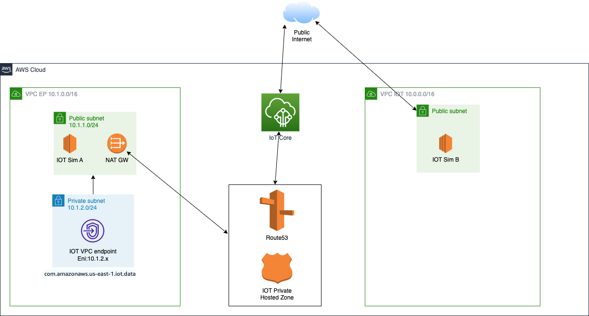

# IoT-Privatelink
The goal of this project is to create IOT private link for customer who wants to send data from IoT device securely through private network without using public internet. In this project we will learn how private link works and create it using sample stack of AWS CloudFormation template.     

Before we get in to detail of how to create IOT private link, it is important to understand few fundamentals services that enable IOT privatelink.

## AWS PrivateLink
AWS PrivateLink is a highly available, scalable technology that enables you to privately connect your VPC to supported AWS services, services hosted by other AWS accounts (VPC endpoint services), and supported AWS Marketplace partner services. You do not need to use an internet gateway, NAT device, public IP address, AWS Direct Connect connection, or AWS Site-to-Site VPN connection to communicate with the service. Therefore, you control the specific API endpoints, sites, and services that are reachable from your VPC.

AWS PrivateLink provides private connectivity between VPCs, AWS services, and your on-premises networks, without exposing your traffic to the public internet. AWS PrivateLink makes it easy to connect services across different accounts and VPCs to significantly simplify your network architecture.

### VPC endpoints:
VPC endpoint is the entry point in your VPC that enables you to connect privately to AWS services. The following are the different types of VPC endpoints. You create the type of VPC endpoint required by the supported service.

1. Gateway endpoint
2. Interface endpoint
3. Gateway Load Balancer endpoint

In this project we will be focusing on creating private data link between IoT device and AWS cloud using VPC Interface endpoint for IOT device data and Private Hosted Zone. 

### VPC IoT Data interface endpoints:
An Interface VPC endpoint for IoT Data allows you to connect IoT devices to services powered by AWS PrivateLink. These services include some AWS services, services hosted by other AWS customers and Partners in their own VPCs (referred to as endpoint services), and supported AWS Marketplace Partner services. The owner of the service is the service provider, and you, as the principal creating the interface endpoint, are the service consumer. By powering these endpoints, AWS PrivateLink brings the same level of security and performance to your IoT network and connected devices.

### Private Hosted Zone
A private hosted zone is a container that holds information about how you want Amazon Route 53 to respond to DNS queries for a domain and its subdomains within one or more VPCs that you create with the Amazon VPC service.

## Getting Started
### Prerequisites

* Amazon AWS account

### Using AWS IoT Core with interface VPC endpoints

With AWS IoT Core, you can create IoT data endpoints within your VPC by using interface VPC endpoints. Interface VPC endpoints are powered by AWS PrivateLink, an AWS technology that you can use to access services running on AWS by using private IP addresses. 

In order to connect devices in the field on remote networks, such as a corporate network to your AWS VPC, refer to the various options listed in the Network-to-Amazon VPC connectivity matrix.

To correctly route DNS queries from your devices to the VPC endpoint interfaces, you must create DNS records in a Private Hosted Zone that is attached to your VPC. Within your Private Hosted Zone, create an alias record for each elastic network interface IP for the VPC endpoint. If you have multiple network interface IPs for multiple VPC endpoints, create weighted DNS records with equal weights across all the weighted records. These IP addresses are available from the DescribeNetworkInterfaces API call when filtered by the VPC endpoint ID in the description field.

### Project Stack Overview
To make this entire process seamless, here is a CloudFormation YAML template that will automate the entire workflow of establishing the communication with the IoT data VPC Interface Endpoint and the Customer's VPC.

### High Level Architecture

## Steps to run project:
1. Create S3 bucket to store artifact in your AWS account 
2. Clone Repository  
3. Open terminal(MAC) or command prompt(window) and go to IoT privatelink project folder. 
4. Setup your AWS credentials using command: aws configure 
5. Please update default values for Environment, UserName, AvailabilityZone1, AvailabilityZone2 to your needs. Note: Please make sure region and availability zones supports IoT VPC interface endpoint. 
6. Run following command to Package project: ./package.bash -b YOUR_BUCKET_NAME 
7. Deploy through cloudformation: ./deploy.bash  -e YOUR_ENVIRONMENT_NAME

## Resource Created during deployment: 
The CloudFormation template creates a Resource Stack in your AWS account and performs the following tasks:

1. Creates temporary IAM user and generate security credentials (AWS Access Key ID, AWS Secret Access Key). Note: Please delete this user at the end of this lab for security.
2. Creates new Key pair for EC2.
3. Creates AWS Access Key ID and AWS Secret Access Key 
4. Creates a 2 new VPCs (VPCA and VPCB) with CIDR Range. This Range is automatically populated from the template; however, it can be set as per the customer's choice.
5. Creates a Public and Private Subnets in VPCA.
6. Route out from Private subnet to Public subnet through NAT gateway.
7. Creates a Public Subnets in VPCB.
8. Creates IoT data VPC Interface Endpoints in the private subnet in VPCA. The Stack will automatically detect the AWS region that the customer is using and the IoT Data Endpoint will be automatically picked up.
9. Attaches Security Groups to the VPC Endpoint in VPCA.
10. Creates the Private Hosted Zone in Route 53 for VPCA.
11. Automatically adds the CNAME record and the DNS Value Name from the VPC Endpoint in VPCA.
12. Creates virtual two IoT devices MyIotThingA and MyIotThingB in the cloud inside Public subnet of VPCA and VPCB.   
 * It creates a t2.micro AWS EC2 instance. 
 * Installs dependencies. 
 * Installs AWS-SDK for Javascript. 
 * Creates IoT certificates and IoT Policy. 
 * Creates things "MyIotThingA" in EC2 IoT Sim-A and "MyIotThingB" in EC2 IoT Sim-B
 * Attaches  certificates and IOT Policy.
 * Publishes message "Hello world!" on topic_A and topic_B to IoT Core.  

## User Actions:
1. In your AWS account, go to EC2 service> instances
2. Select on IoT Sim A and click connect from top bar.  
3. Under EC2 Instance Connect tab, click Connect. This will open EC2 terminal window for IoT Sim-A.
4. In EC2 terminal window, run command sudo cat /var/log/cloud-init-output.log. This will open log file which shows all activity described in step-8 in previous section.
5. At the bottom of logs, you will see data being published from EC2 IoT Sim-A to AWS IoT endpoint as show below.  Please keep this window open for further evaluation.   

> * Endpoint_Address=axhgvssc6t2vf-ats.iot.us-east-1.amazonaws.com
> * node dist/index.js --topic topic_1 --root-ca /root/certs/Amazon-root-CA-1.pem --cert /root/certs/device.pem.crt --key /root/certs/private.pem.key --endpoint axhgvssc6t2vf-ats.iot.us-east-1.amazonaws.com
> * Publish received. topic:"topic_1" dup:false qos:1 retain:false
> * {"message":"Hello world!","sequence":1}
> * Publish received. topic:"topic_1" dup:false qos:1 retain:false
> * {"message":"Hello world!","sequence":2}
> * Publish received. topic:"topic_1" dup:false qos:1 retain:false
> * {"message":"Hello world!","sequence":3}
> * Publish received. topic:"topic_1" dup:false qos:1 retain:false
> * {"message":"Hello world!","sequence":4}
> * Publish received. topic:"topic_1" dup:false qos:1 retain:false
> * {"message":"Hello world!","sequence":5}
> * Publish received. topic:"topic_1" dup:false qos:1 retain:false
> * {"message":"Hello world!","sequence":6}
> * Publish received. topic:"topic_1" dup:false qos:1 retain:false
> * {"message":"Hello world!","sequence":7}
> * Publish received. topic:"topic_1" dup:false qos:1 retain:false
> * {"message":"Hello world!","sequence":8}
> * Publish received. topic:"topic_1" dup:false qos:1 retain:false
> * {"message":"Hello world!","sequence":9}
> * Publish received. topic:"topic_1" dup:false qos:1 retain:false
> * {"message":"Hello world!","sequence":10}
> * Cloud-init v. 19.3-44.amzn2 finished at Sat, 23 Apr 2022 22:01:56 +0000. Datasource DataSourceEc2.  Up 206.97 seconds

6. Repeat steps 2-5 for EC2 simulator IoT Sim-B. Logs should look like as show below.

> * ++ jq -r .endpointAddress
> * + Endpoint_Address=axhgvssc6t2vf-ats.iot.us-east-1.amazonaws.com
> * + node dist/index.js --topic topic_B --root-ca /root/certs/Amazon-root-CA-1.pem --cert /root/certs/device.pem.crt --key /root/certs/private.pem.key --endpoint axhgvssc6t2vf-ats.iot.us-east-1.amazonaws.com
> * Publish received. topic:"topic_B" dup:false qos:1 retain:false
> * {"message":"Hello world!","sequence":1}
> * Publish received. topic:"topic_B" dup:false qos:1 retain:false
> * {"message":"Hello world!","sequence":2}
> * Publish received. topic:"topic_B" dup:false qos:1 retain:false
> * {"message":"Hello world!","sequence":3}
> * Publish received. topic:"topic_B" dup:false qos:1 retain:false
> * {"message":"Hello world!","sequence":4}
> * Publish received. topic:"topic_B" dup:false qos:1 retain:false
> * {"message":"Hello world!","sequence":5}
> * Publish received. topic:"topic_B" dup:false qos:1 retain:false
> * {"message":"Hello world!","sequence":6}
> * Publish received. topic:"topic_B" dup:false qos:1 retain:false
> * {"message":"Hello world!","sequence":7}
> * Publish received. topic:"topic_B" dup:false qos:1 retain:false
> * {"message":"Hello world!","sequence":8}
> * Publish received. topic:"topic_B" dup:false qos:1 retain:false
> * {"message":"Hello world!","sequence":9}
> * Publish received. topic:"topic_B" dup:false qos:1 retain:false
> * {"message":"Hello world!","sequence":10}
> * Cloud-init v. 19.3-44.amzn2 finished at Fri, 07 Oct 2022 01:13:12 +0000. Datasource DataSourceEc2.  Up 213.65 seconds
> * [ec2-user@ip-10-0-0-26 ~]$ dig axhgvssc6t2vf-ats.iot.us-east-1.amazonaws.com

7. Please note, Both simulator A and B publishes to same iot endpoint in you account as show below.  
8. Go to IoT Sim A Instance connect terminal and run dig command:(dig command stands for Domain Information Groper. It is used for retrieving information about DNS name servers.) 
    dig <iot_endpoint>. 

9. You will see below result. Please notice endpoint ip address (10.1.2.245). It is private ip address with in private subnet.  

> * [ec2-user@ip-10-1-1-98 ~]$ dig axhgvssc6t2vf-ats.iot.us-east-1.amazonaws.com
> * 
> * ; <<>> DiG 9.11.4-P2-RedHat-9.11.4-26.P2.amzn2.5.2 <<>> axhgvssc6t2vf-ats.iot.us-east-1.amazonaws.com
> * ;; global options: +cmd
> * ;; Got answer:
> * ;; ->>HEADER<<- opcode: QUERY, status: NOERROR, id: 27446
> * ;; flags: qr rd ra; QUERY: 1, ANSWER: 2, AUTHORITY: 0, ADDITIONAL: 1
> * 
> * ;; OPT PSEUDOSECTION:
> * ; EDNS: version: 0, flags:; udp: 4096
> * ;; QUESTION SECTION:
> * ;axhgvssc6t2vf-ats.iot.us-east-1.amazonaws.com. IN A
> * 
> * ;; ANSWER SECTION:
> * axhgvssc6t2vf-ats.iot.us-east-1.amazonaws.com. 5 IN CNAME vpce-0b1ea22b5753b7a86-7yq7jgyr.data.iot.us-east-1.vpce.amazonaws.com.
> * vpce-0b1ea22b5753b7a86-7yq7jgyr.data.iot.us-east-1.vpce.amazonaws.com. 60 IN A 10.1.2.245
> * 
> * ;; Query time: 5 msec
> * ;; SERVER: 10.1.0.2#53(10.1.0.2)
> * ;; WHEN: Sun Apr 24 00:38:46 UTC 2022
> * ;; MSG SIZE  rcvd: 160

10. Go to IoT Sim B Instance connect terminal and run dig command: 
    dig <iot_endpoint>. 
11. You will see below result. Please notice endpoint ip addresses. It is public ip address.  

> * [ec2-user@ip-10-0-0-26 ~]$ dig axhgvssc6t2vf-ats.iot.us-east-1.amazonaws.com
> * 
> * ; <<>> DiG 9.11.4-P2-RedHat-9.11.4-26.P2.amzn2.5.2 <<>> axhgvssc6t2vf-ats.iot.us-east-1.amazonaws.com
> * ;; global options: +cmd
> * ;; Got answer:
> * ;; ->>HEADER<<- opcode: QUERY, status: NOERROR, id: 15170
> * ;; flags: qr rd ra; QUERY: 1, ANSWER: 8, AUTHORITY: 0, ADDITIONAL: 1
> * 
> * ;; OPT PSEUDOSECTION:
> * ; EDNS: version: 0, flags:; udp: 4096
> * ;; QUESTION SECTION:
> * ;axhgvssc6t2vf-ats.iot.us-east-1.amazonaws.com. IN A
> * 
> * ;; ANSWER SECTION:
> * axhgvssc6t2vf-ats.iot.us-east-1.amazonaws.com. 60 IN A 107.23.62.192
> * axhgvssc6t2vf-ats.iot.us-east-1.amazonaws.com. 60 IN A 3.217.44.117
> * axhgvssc6t2vf-ats.iot.us-east-1.amazonaws.com. 60 IN A 35.173.167.253
> * axhgvssc6t2vf-ats.iot.us-east-1.amazonaws.com. 60 IN A 52.20.147.50
> * axhgvssc6t2vf-ats.iot.us-east-1.amazonaws.com. 60 IN A 52.22.80.21
> * axhgvssc6t2vf-ats.iot.us-east-1.amazonaws.com. 60 IN A 52.45.193.191
> * axhgvssc6t2vf-ats.iot.us-east-1.amazonaws.com. 60 IN A 52.55.165.48
> * axhgvssc6t2vf-ats.iot.us-east-1.amazonaws.com. 60 IN A 52.200.8.167
> * 
> * ;; Query time: 2 msec
> * ;; SERVER: 10.0.0.2#53(10.0.0.2)
> * ;; WHEN: Sat Oct 08 18:44:17 UTC 2022
> * ;; MSG SIZE  rcvd: 202

## Conclusion:
This proves that IoT Simulator-A  is sending data to AWS cloud IoT endpoint via Privatelink created through VPC interface endpoint routing through Private Hosted Zone. While IoT Simulator-B which does not have any privatelink established, is sending data over public internet. 

## Security

See [CONTRIBUTING](CONTRIBUTING.md#security-issue-notifications) for more information.

## License

This library is licensed under the MIT-0 License. See the LICENSE file.

